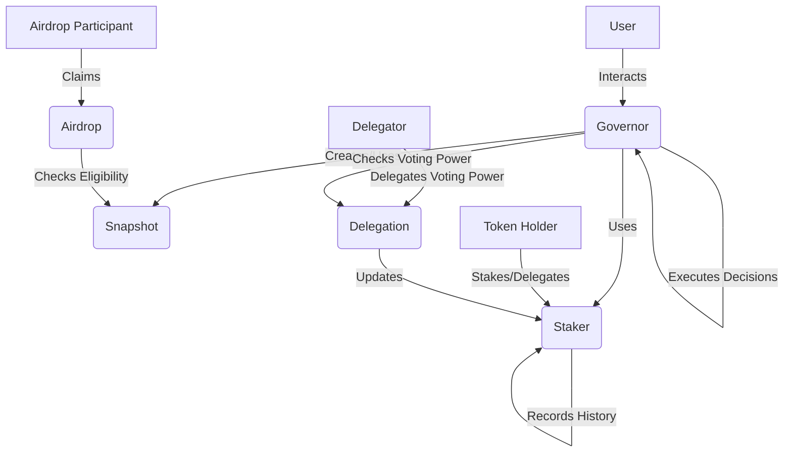

# Governance

>:warning: This package is under active development and yet audited for security. Use at your own risk.

This repository contains realms (smart-contracts) for token-based governance on gno.land. Any gno.land-based tokens can use `Airdrop` and 'Snapshot` for distributing tokens, and use `Staker`, `Delegation, and `Governor` for governance. All realms are customizable, meaning they can be used together, or independently. 

## Key Components

1. **Snapshot**: `Snapshot` provides capturing, storing, and retrieving snapshots of the state of a system at specific points in time, including claimed bitmaps and the number of remaining tokens.

2. **Airdrop**: `Airdrop` handles token distribution events, including the claiming process and refund if necessary.

3. **Staker**: `Staker` allows users to stake tokens and delegate voting power. It maintains a history of delegation data to support time-weighted voting.

4. **Delegation**: `Delegation` allows token holders to delegate their voting power without transferring token ownership, increasing governance participation flexibility.

5. **Governor**: `Governor` manages the proposal's lifecycle, including creation, voting, and execution. It also handles the governance configuration and upgrades.

## System Overview

The following diagram illustrates hw the main components of the governance system interact with each other:



## Features

- Distribution gno.land based tokens with `Snapshot` and `Airdrop`
- Creation of a governance system for gno.land based tokens with `Staker`, `Delegation`, and `Governor`
- Proposal creation and management
- Configurable governance parameters
- Providing query functions for delegators such as current delegation, historical delegation, average delegation, and cumulative delegation
- Upgradable contract design

## Usage

Here's a basic example of how to use:

```go
package main

import (
    "gno.land/r/governance/governor"
    "gno.land/r/governance/staker"
    "gno.land/p/demo/grc/grc20"
)

func main() {
    // Initialize the underlying token
    token := grc20.NewToken("Governance Token", "GOV", 18)

    // Initialize the staker
    staker.Init(token)

    // Initialize the governor with a configuration
    config := governor.Config{
        VotingPeriod: 604800, // 1 week in seconds
        // ... other config parameters
    }
    governor.Init(staker, config)

    // Create a proposal
    proposalID, _ := governor.Propose(`[{"to": <address>, "selector": 1, "data": "..."}]`)

    // Vote on the proposal
    governor.Vote(proposalID, true)

    // Execute the proposal after voting period
    governor.Execute(proposalID, `[{"to": <address>, "selector": 1, "data": "..."}]`)
}
```

## Testing

To run the tests, move all the subdirectories to the forked `gno` repository and run the following command:

```bash
cd governance
gno test -v .
```

If it does not work, reinstall the gno again:

```bash
make install
```

## License

This package is licensed under the MIT License. See the [LICENSE](LICENSE) file for more information.
