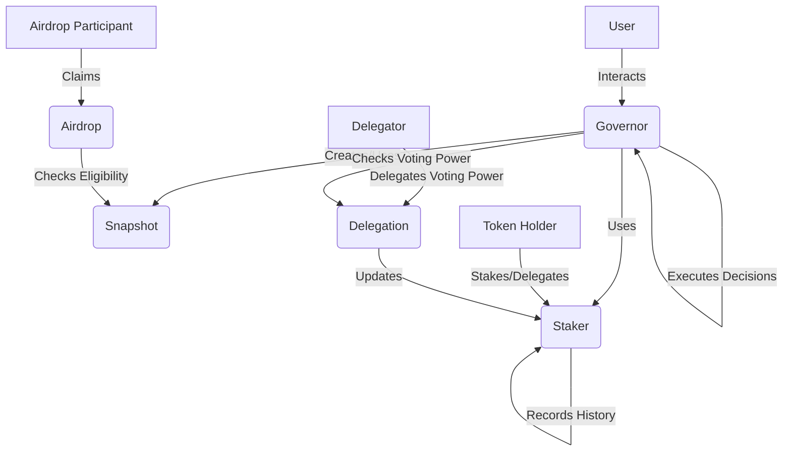

# governance

>:warning: This package is under active development and yet audited for security. Use at your own risk.

The governance system is a comprehensive decentralized solution for managing proposals, voting and executing decisions in a a environment. It is designed to be gno platform.

## Key Components

1. **Governor**: Manages the proposal's lifecycle, including creation, voting, and execution. It also handles the governance configuration and upgrade.

2. **Staker**: Allows users to stake tokens and delegate voting power. It maintains a history of delegation data to support time-weighted voting.

3. **Snapshot**: Provides a Cairo's snapshot functionality. It captures the state of the system at specific points in time.

4. **Airdrop**: handles token distribution events, including the claiming process and refund if necessary.

5. **Delegation**: Allows token holders to delegate their voting power without transferring token ownership, increasing governance participation flexibility.

## System Overview

The following diagram illustrates hw the main components of the governance system interact with each other:



## Features

- Proposal creation and management
- Configurable governance parameters
- Upgradable contract design

## Usage

Here's a basic example of how to use:

```go
package main

import (
    "gno.land/r/governance/governor"
    "gno.land/r/governance/staker"
    "gno.land/p/demo/grc/grc20"
)

func main() {
    // Initialize the underlying token
    token := grc20.NewToken("Governance Token", "GOV", 18)

    // Initialize the staker
    staker.Init(token)

    // Initialize the governor with a configuration
    config := governor.Config{
        VotingPeriod: 604800, // 1 week in seconds
        // ... other config parameters
    }
    governor.Init(staker, config)

    // Create a proposal
    proposalID, _ := governor.Propose(`[{"to": <address>, "selector": 1, "data": "..."}]`)

    // Vote on the proposal
    governor.Vote(proposalID, true)

    // Execute the proposal after voting period
    governor.Execute(proposalID, `[{"to": <address>, "selector": 1, "data": "..."}]`)
}
```

## Testing

To run the tests, move all the subdirectories to the forked `gno` repository and run the following command:

```bash
cd governance
gno test -v .
```

If it does not work, reinstall the gno again:

```bash
make install
```

## License

This package is licensed under the MIT License. See the [LICENSE](LICENSE) file for more information.
