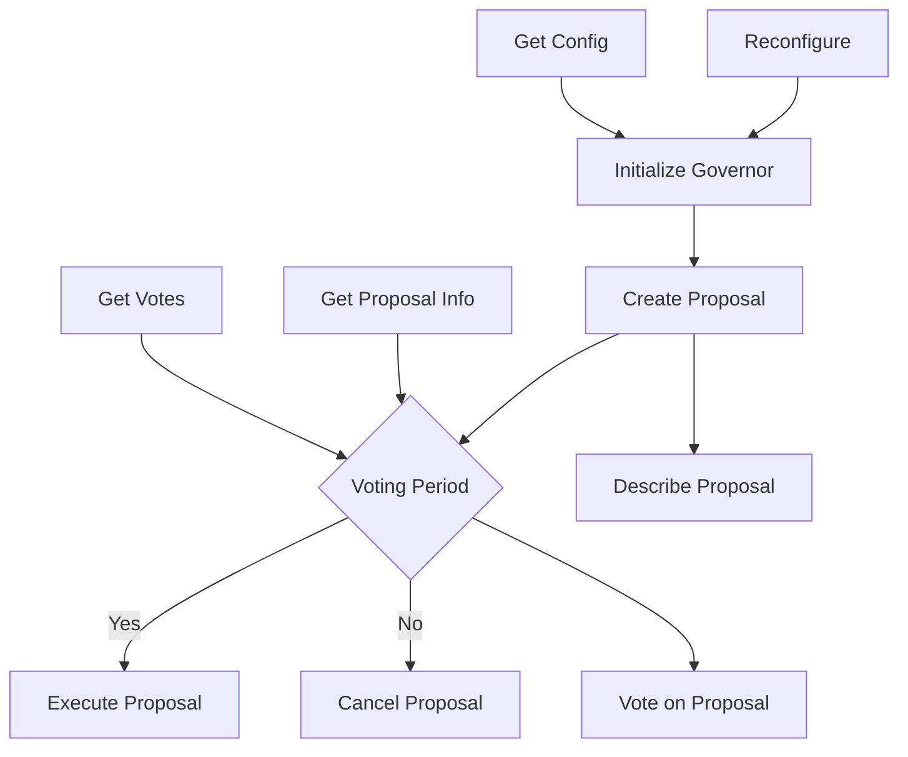

# Governor Contract

## Overview



The Governor contract is a decentralized governance system implemented in gno for the gno.land. It allows token holders to propose, vote on, and execute changes to the system.

## Features

- Proposal Creation: Users can create proposals for changes to the system.
- Voting: Token holders can vote on proposals.
- Execution: Approved proposals can be executed.
- Configuration Management: The governance parameters can be adjusted.
- Upgradability: The contract can be upgraded to new versions.

## Main Components

1. **Proposal System**: Allows creation and management of proposals.
2. **Voting Mechanism**: Enables token holders to vote on proposals.
3. **Execution System**: Executes approved proposals.
4. **Configuration Management**: Manages and updates governance parameters.

## Key Functions

- `Propose`: Create a new proposal.
- `Vote`: Cast a vote on a proposal.
- `Execute`: Execute an approved proposal.
- `Cancel`: Cancel a proposal (by the proposer or if conditions are met).
- `Reconfigure`: Update the governance parameters.
- `Upgrade`: Upgrade the Governor contract (mechanism to be finalized). [TODO]

## Getting Started

### Prerequisites

- latest version of gnoVM

### Usage

1. Initialize the `Governor`

```go
config := Config{...}  // Set your initial configuration
Init(stakerAddress, config)
```

2. Create a proposal

```go
calls := []Call{...}  // Define the actions of your proposal
proposalID := Propose(calls)
```

3. Execute a proposal

```go
Execute(proposalID, calls)
```

### License

This project is licensed under the [MIT License](LICENSE).

### Disclaimer

This contract is currently unaudited and in development. Use at your own risk.
