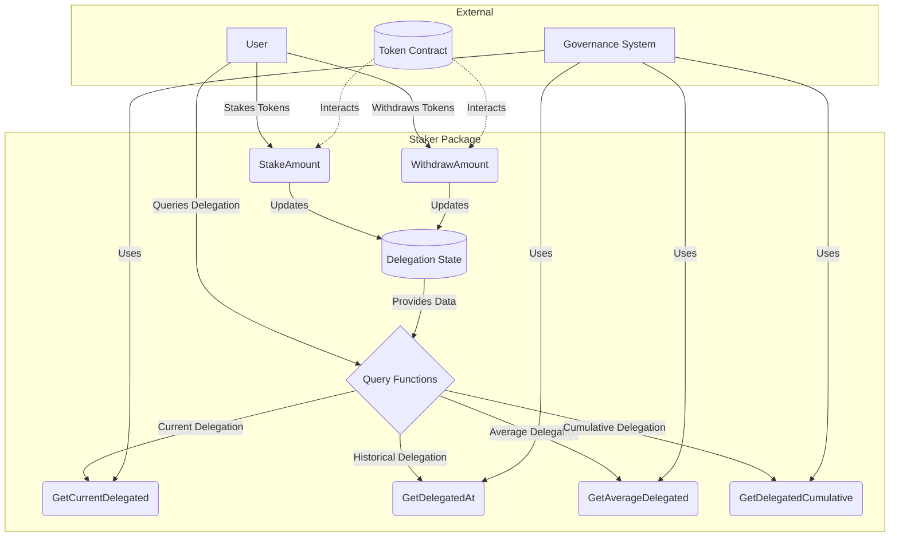

# Staker

The `staker` is a component of the governance system, providing a functionality for token staking and delegation. It allows users to stake their tokens and delegate voting power to other users (or addresses), who can then vote on their behalf.

## Purpose

The primary purpose of the staker is to:

- Enable token holders to stake their tokens, demonstrating their commitment to the ecosystem.
- Allow stakers to delegate their voting power to other users, accelerating flexible governance participation.
- Keep track the historical delegation data to support a time-weighted voting mechanism.
- Provide functionalities for calculating average delegated amounts over specific time periods.

## Flows

## Main Functions

1. `StakeAmount(delegate, amount string)`: Stakes tokens and delegates them to a specified address.
2. `WithdrawAmount(delegate, recipient, amount string)`: Allows delegates to withdraw staked tokens.
3. `GetDelegatedCumulative(delegate string, timestamp uint64)`: Calculates cumulative delegation up to a specific timestamp.
4. `GetAverageDelegated(delegate string, start, end uint64)`: Computes average delegation over a time range.
5. `GetAverageDelegatedOverLast(delegate string, period uint64)`: Calculates average delegation over the most recent period.
6. `GetCurrentDelegated(delegate string)`: Retrieves the current delegated amount for an address.
7. `GetDelegatedAt(delegate string, timestamp uint64)`: Fetches the delegated amount at a specific point in time.

## Security Considerations

- Only authorized addresses (typically governance contracts) should be allowed to call certain functions like `WithdrawAmount`.
- The `StakeAmount` function should be called only after appropriate token approvals have been made.
- Care should be taken to prevent potential overflow issues in time and amount calculations.

## Notes

- The package uses `uint256` for accurate numerical calculations internally. But the outside dApps cannot handle `uint256` directly. Therefo
re, the package uses primitive type (i.e., `string`) for the outside world.

## License

The staker is licensed under the [MIT License](LICENSE).
