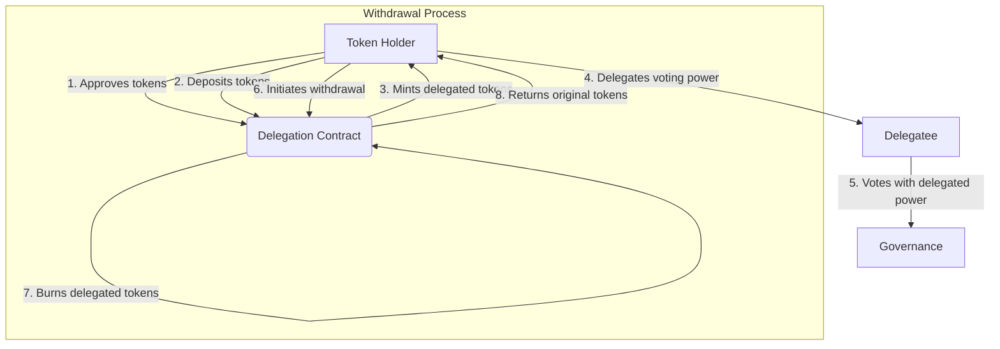

# Delegated Token

## Overview

The `delegation` package provides a mechanism for token holders to delegate their voting power to other addresses without transferring ownership of their tokens.

This is useful in governance systems where token holders may want to participate in decision-making processes but delegate the actual voting to more active or reliable participants.

## Flow of Token Delegation

The following diagram illustrates the flow of delegation in the `delegation` package:



## Usage

1. Initialization:

    ```go
    New(staker std.Address, token grc20.Token, name string, symbol string, contractAddr std.Address)
    ```

    Initialize the delegation contract with the staker address, underlying token, name, symbol, and the address of the contract.

2. Depositing Tokens:

    > :warning: Passing parameter must be the valid `std.Address` value but string type.

    ```go
    Deposit(amount, caller string)
    ```

    Deposit tokens to receive delegated tokens.

3. Delegating Tokens:

    > :warning: Passing parameter must be the valid `std.Address` value but string type.

    ```go
    Delegate(owner, to string)
    ```

    Delegate voting power the owner to the delegatee.

4. Checking Delegation:

    > :warning: Passing parameter must be the valid `std.Address` value but string type.

    ```go
    GetDelegatedTo(owner string) std.Address
    ```

    Check which address an owner has delegated to.

5. Withdrawing Tokens:

    > :warning: Passing parameter must be the valid `std.Address` value but string type.

    ```go
    Withdraw(amount, caller string)
    ```

    Withdraw tokens from the delegation contract.

## Implementation Details

- The package uses global `DelegatedToken` instance to manage state.
- Delegated token balances are tracked separately from the underlying token balances.

## Considerations

1. **Token Approval**: Users must approve the delegation contract to spend their tokens before depositing them.

2. **Delegation vs Transfer**: Delegating tokens does not transfer token ownership. The original token holder retains the ability to withdraw their tokens at any time.

3. **One-to-One Delegation**: Each address can only delegate to one other address at a time. To change delegation, simply call `Delegate` again with the new delegatee address.

4. **Withdraw Limitation**: Users can only withdraw up to the amount they have deposited. Attempting to withdraw more will cause a panic.

5. **Realm Interaction**: When integrating with other contracts or realms, be aware of the current realm and use the appropriate methods like `std.GetOrigPkgAddr()` to ensure proper behavior.

## Example

The following example demonstrates how to use the `delegation` package to delegate voting power in a governance system:

## Examples

### Basic Usage

This example demonstrates the basic usage of the delegation package:

```go
package main

import (
    "fmt"
    "std"
    "gno.land/p/demo/grc/grc20"
    "gno.land/p/demo/delegation"
)

func main() {
    // Initialize the underlying token (assuming we have a GRC20 token)
    token := grc20.NewToken("Example Token", "EXT", 18)
    
    // Initialize the delegation contract
    staker := std.Address("g1ckae7tc5sez8ul3ssne75sk4muwgttp6ks2ky9")
    contractAddr := std.Address("g1ecely4gjy0yl6s9kt409ll330q9hk2lj9ls3ec")
    delegation.New(staker, token, "Delegated Example Token", "dEXT", contractAddr)
    
    // User deposits tokens
    userAddr := std.Address("g1us8428u2h5wcqvauadh8jnmnvdc4u63amfghncm")
    token.Approve(contractAddr, 1000) // Approve delegation contract to spend tokens
    delegation.Deposit("1000", userAddr.String())
    
    // User delegates to another address
    delegateeAddr := std.Address("g1s80xtktyc9jf262r8tu0h6a7ccxtk5g0apwerv4")
    delegation.Delegate(userAddr.String(), delegateeAddr.String())
    
    // Check delegation
    delegatedTo := delegation.GetDelegatedTo(userAddr.String())
    fmt.Printf("User delegated to: %s\n", delegatedTo)
    
    // User withdraws tokens
    delegation.Withdraw("500", userAddr.String())
}
```

### Cross-Realm Interaction

Here's an example of how the delegation might interact across different realms:

```go
package main

import (
    "fmt"
    "std"
    "gno.land/p/demo/grc/grc20"
    "gno.land/p/demo/delegation"
    "gno.land/p/demo/ufmt"
)

func main() {
    // Initialize the underlying token
    token := grc20.NewToken("Example Token", "EXT", 18)
    
    // Initialize the delegation contract
    staker := std.Address("g1ckae7tc5sez8ul3ssne75sk4muwgttp6ks2ky9")
    delegationContractAddr := std.Address("g1ecely4gjy0yl6s9kt409ll330q9hk2lj9ls3ec")
    delegation.New(staker, token, "Delegated Example Token", "dEXT", delegationContractAddr)
    
    // Set up realms
    userRealm := std.NewUserRealm(std.Address("g1us8428u2h5wcqvauadh8jnmnvdc4u63amfghncm"))
    otherRealm := std.NewCodeRealm("gno.land/r/demo/other")
    delegationRealm := std.NewCodeRealm("gno.land/r/demo/delegation")
    
    // User approves and deposits tokens
    std.TestSetRealm(userRealm)
    token.Approve(delegationContractAddr, 1000)
    
    // Simulate cross-realm call: User -> Other Realm -> Delegation Contract
    std.TestSetRealm(otherRealm)
    std.TestSetOrigPkgAddr(std.GetOrigPkgAddr())
    
    // Call deposit function (this should internally use the delegation realm)
    std.TestSetRealm(delegationRealm)
    delegation.Deposit("1000", userRealm.Addr().String())
    
    // Check balance
    balance := delegation.BalanceOf(userRealm.Addr().String())
    fmt.Printf("User's delegated token balance: %s\n", balance.ToString())
}
```

In this cross-realm example:

  1. We set up different realms for the user, an intermediary contract, and the delegation contract.

  2. We simulate a cross-realm call where the user interacts with the delegation contractthrough an intermediary contract.

  3. The delegation contract correctly handles the call. maintaining the user's balance deposit the cross-realm call.

These examples demonstrate how to use the Delegation package in both simple and complex scenarios, including cross-realm interactions. Remember to handle errors and panics appropriately in your actual implementation.
